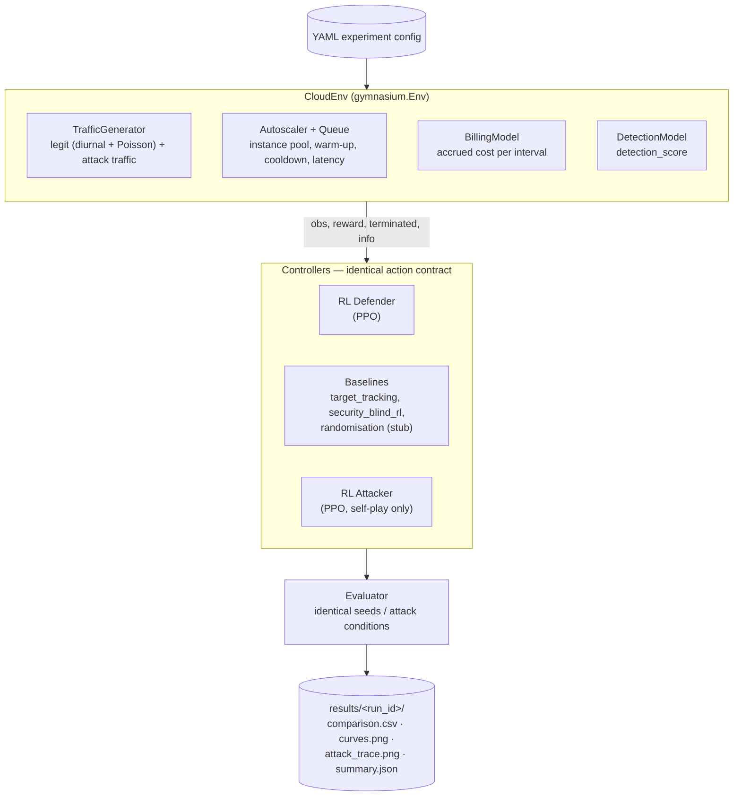

# RL-EDoS

**An adversarial reinforcement-learning testbed for defending cloud autoscalers against Economic Denial of Sustainability (EDoS) attacks.**


## Overview

Cloud autoscaling trades money for availability: it provisions more compute as observed load rises. An **Economic Denial of Sustainability (EDoS)** attack weaponises this by sending traffic that looks legitimate request-by-request but is collectively shaped to keep the autoscaler over-provisioning — uptime and error-rate monitoring show nothing wrong, but the cloud bill inflates.

RL-EDoS is a **headless, offline research testbed**: a simulated cloud (instance pool, request queue, billing, and a statistical detection model) in which an attacker agent and a defender agent learn against each other, with the goal of producing an autoscaling policy that stays cheap **and** fast under attack — beating both classic target-tracking autoscaling and a "security-blind" RL baseline, simultaneously, on cost and latency.

It is built for cloud-security researchers and platform/SRE engineers evaluating adversarial RL as a hardening technique for autoscaling — not a production autoscaler, not a live intrusion-detection system, and not a web app. There is no server, no database, and no live cloud API calls; everything runs locally from the command line over YAML configs and produces file artifacts (CSVs, plots, checkpoints).

> **Current status:** the simulation, training pipeline, baselines, and evaluation harness are all implemented and tested. The project's headline research result — the RL defender beating both baselines on both cost and latency — has **not yet been achieved**; see [Roadmap / Future Work](#roadmap--future-work) for the documented, diagnosed reason why and the exact next step.

## Key Features

- **Gymnasium-compatible simulated cloud** (`CloudEnv`) — instance pool with launch warm-up and scaling cooldown, a queue-based latency model, and per-second billing, stepped one control interval at a time.
- **Economically-faithful billing model** — pricing and billing-granularity constants are derived from real AWS EC2 on-demand pricing and cited in code comments (`src/rl_edos/env/billing.py`), not invented; warming instances are billed from launch, which is the core EDoS attack surface.
- **Scripted + learned attack traffic** — steady, oscillation, and burst scripted attack patterns, plus an optional PPO-trained *learned* attacker (from self-play) that can be evaluated directly against the defender.
- **A statistical detection model** (rate/variance threshold) that bounds how aggressively an attacker can shape traffic before being penalised — a simulation constraint, not a production IDS.
- **PPO defender training** (Stable-Baselines3) with `VecNormalize` observation normalization and a NaN/divergence guard that refuses to ever persist a broken policy as valid.
- **Three reference baseline controllers** sharing the exact same action contract as the RL defender: `target_tracking` (AWS ASG-style target-tracking), `security_blind_rl` (PPO trained without detection awareness), and a `randomisation` stub (not yet implemented — see Roadmap).
- **A seeded evaluation harness** that runs every controller under identical attack conditions and writes `comparison.csv` (mean **and** standard deviation across multiple seeds), real PPO training-curve plots, and attack-trace visualisations.
- **Co-evolutionary self-play** — an alternating freeze/train loop between a learned attacker and the defender, with automatic convergence detection and a graceful, documented failure-analysis path instead of crashing on non-convergence.
- **Fully deterministic** — every stochastic component is seeded; identical config + seed reproduces identical episodes and results, and every run records its config hash, git SHA, and seed.
- **92 passing unit tests**, `black` + `ruff` clean.

## Demo / Screenshots

<!-- TODO: no screenshots or demo recording exist in this repository yet. Generated plots
     (comparison.csv, curves.png, attack_trace.png) can be produced locally by running
     `rl-edos evaluate` — see Usage below — and added here. -->

## Architecture

There is no HTTP layer or database — the "cloud" is entirely simulated in-process. A YAML config drives one `CloudEnv` episode at a time; every controller (the RL defender, the baselines, and — in self-play — the RL attacker) observes the same state and emits actions through the same contract, so the `Evaluator` can compare them fairly under identical seeded conditions.



See [`docs/02_ARCHITECTURE.md`](docs/02_ARCHITECTURE.md) for the full module-boundary breakdown and interface contracts.

## Tech Stack

| Layer | Technology |
|---|---|
| Language | Python 3.11 |
| Simulation environment | Gymnasium (`gymnasium.Env`) |
| Reinforcement learning | Stable-Baselines3 (PPO) on PyTorch |
| Numerics / data | NumPy, Pandas |
| Config validation | Pydantic |
| Persistence | YAML (configs), CSV/Parquet (metrics), SB3 `.zip` (checkpoints) |
| Experiment tracking | TensorBoard, Matplotlib, Seaborn |
| Dev tooling | black, ruff, pytest |
| Infra | None — single-user local CLI tool; no server, database, auth, or live cloud calls |

## Project Structure

```
rl-edos/
  src/rl_edos/
    env/          # CloudEnv, BillingModel, TrafficGenerator, DetectionModel, attacks — the simulation core
    agents/       # PPO wrappers + observation/action/reward definitions (defender + attacker)
    baselines/    # target_tracking, security_blind_rl, randomisation (stub) — same action contract as the RL defender
    training/     # PPO training helpers, Trainer, and the self-play loop
    evaluation/   # Evaluator, metrics computation, plotting, artifact writing
    config.py     # pydantic ExperimentConfig — validated on load, fails fast on bad config
    configs/      # YAML experiment configs (one consolidated file per experiment)
    cli.py        # command surface: train-defender, evaluate, selfplay, plot
  tests/          # unit tests for every module above (92 tests)
  docs/           # full project spec, architecture, data schemas, fidelity sources, phase-by-phase build history
  results/        # generated run artifacts — gitignored
  pyproject.toml
  LICENSE
```

## Getting Started

### Prerequisites

- Python **3.11** (the package is pinned to `>=3.11,<3.12`)
- `pip`
- No GPU required — the simulation is lightweight enough to train on CPU

### Installation

```bash
python3.11 -m venv .venv
source .venv/bin/activate          # Windows: .venv\Scripts\activate
pip install -e ".[dev]"
rl-edos --help
```

### Environment variables

None. RL-EDoS has no secrets, no external services, and no network calls — every experiment is configured entirely through a single YAML file passed via `--config`.

## Usage

Every command takes a consolidated experiment config (see `src/rl_edos/configs/default.yaml`).

**Run the baseline comparison demo** (no training required):

```bash
rl-edos evaluate --config src/rl_edos/configs/default.yaml --baselines all
rl-edos plot --run <run_id printed by the command above>
```

**Train the RL defender, then evaluate it against the baselines:**

```bash
rl-edos train-defender --config src/rl_edos/configs/default.yaml --out models/defender
rl-edos evaluate --config src/rl_edos/configs/default.yaml --policy models/defender --baselines all --seeds 0 1 2
```

`--seeds` (optional; defaults to the config's own seed) averages metrics across multiple seeded episodes and reports the standard deviation for each metric in `comparison.csv`.

**Run co-evolutionary self-play** (a PPO attacker and defender alternately train against each other):

```bash
rl-edos selfplay --config src/rl_edos/configs/selfplay_demo.yaml --out models/selfplay
```

This prints the exact follow-up command to evaluate the resulting defender against its own trained attacker (`attack.mode: learned` in the config).

**Example output** (`rl-edos evaluate` prints a summary and writes `results/<run_id>/comparison.csv`):

```
target_tracking (n_seeds=3): {'mean_cost_under_attack': 0.00399, 'p95_latency_ms': 20.0, 'legit_drop_rate': 0.0045, 'overprovision_ratio': 2.03, 'reward_curve_ref': ''}
rl_defender      (n_seeds=3): {'mean_cost_under_attack': 0.00878, 'p95_latency_ms': 20.0, 'legit_drop_rate': 0.0045, 'overprovision_ratio': 4.53, 'reward_curve_ref': 'results/<run_id>/curves.png'}
```

## Testing

```bash
pytest              # 92 tests: env dynamics, billing, detection, baselines, reward math, training, self-play
black --check .      # formatting
ruff check .          # linting
```

## Roadmap / Future Work

These are open items documented in the codebase itself (`CLAUDE.md`, `docs/PHASE_3_RL_DEFENDER.md`), not speculative plans:

- **Close the core research gap.** The RL defender does not yet beat both baselines on cost and latency simultaneously. A concrete, evidence-backed likely cause is documented in `docs/PHASE_3_RL_DEFENDER.md`'s "Current status" section: the defender's reward weights (`cost_w`/`latency_w`) produce contributions roughly 50x apart in scale given the default config's real cost/latency magnitudes, so training is dominated by latency almost regardless of cost. The documented next step is a reward-weight retune combined with a much larger training budget (500k-2M timesteps).
- **Re-validate self-play once the above closes.** The self-play loop is implemented and tested, but was built before the defender result above was closed out, so it is explicitly marked "not gated" — any self-play result today should be treated as a plumbing smoke test, not a research finding.
- **Implement the `randomisation` baseline** — currently a stub (`src/rl_edos/baselines/randomisation.py`), left out because two baselines were judged sufficient for the core comparison.
- **Optional results dashboard** — a lightweight static-HTML or Streamlit view aggregating a run's artifacts, listed as a cuttable post-MVP feature in `docs/01_PROJECT_SPEC.md`.

## Contributing

This is a research codebase, not currently accepting external contributions. If you'd like to build on it, fork the repository — `docs/` contains the full design spec, module boundaries, and fidelity requirements the code is built against.


